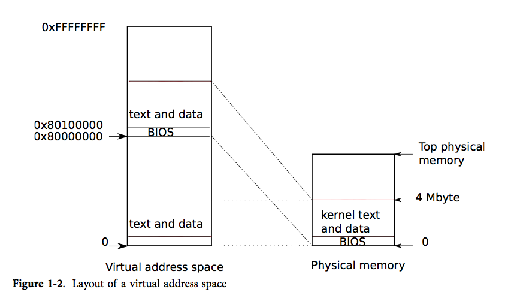

## 第1章

### 操作系统组织架构
操作系统的一个重要需求就是支持一些系统相关活动（several activitys）。例如，使用第0章介绍的系统调用接口，一个进程可以使用fork创建一个新的进程。操作系统必须协调（arrange)所有的进程都是分时复用（time-share）PC的资源。比如，一个进程可以创建多于PC处理器的新进程，但是所有的进程都应该得到执行（yet all processs must be able to make some process）。而且操作系统必须保证协调不同进程之间的隔离（isolation）。具体地说，假如一个进程有bug然后崩溃， 它不应该会影响到和它无关(no dependency)的进程。但是,如果实现太强（strong），太绝对的隔离， 进程间的通信就变得不太可能。多进程结合比如使用管道（pipes）从而实现复杂任务，对用户来说会感到很方便。因此， 一个操作系统必须达到三个要求：
1. 复用(multiplexing)
2. 隔离（isolation）
3. 交互通信（interfaction）

本章对操作系统如何达到这三个要求提供了一个概览。 条条大路通罗马（It turns out there are many ways to do so）， 但是本文主要关注点为主流设计的Unix使用的单内核（monolithic kernel）。本章介绍操作系统的组织架构以跟踪xv6开始运行时创建的第一个进程为例。在介绍这些之前，本文还提供xv6所有主要抽象层（all major abstractions）实现的简介（glimpse），包括它们如何交互， 以及复用(multiplexing)，隔离（isolation），交互通信（interfaction）三个要求如何实现， 接下来的章节会探讨每个抽象层的更多细节。
Xv6抛在Intel 80386 或者后来的x86处理器平台上， 多数的xv6底层功能，比如进程实现都是x86实现（x86-specific）。本书假设读者已经对某些平台的机器汇编级别（machine-level）编程有所了解。如果有和x86实现(x86-specific有关的概念出现，本书会做进一步解释。 附录A简单介绍了PC平台的相关概念

###用户模式（user mode）， 内核模式（kernel mode），系统调用（system calls）
为了在使用系统调用的应用程序和系统调用的实现之间建立强健的隔离（strong isolation），我们需要在应用层和操作系统之间有一个稳固的边界（hard boundary）。 如果应用程序犯错误，我们不希望操作系统崩溃。相反的，操作系统能够清理崩溃的应用程序接着执行其他应用。强健的隔离（strong isolation）意味着应用程序不能更改写入操作系统保持的数据结构，也不能覆盖操作系统的指令等等。
处理器提供的硬件支持使得如此强健的隔离（strong isolation）可以实现。例如, 同其他处理器一样，x86处理器执行指令有两种模式：内核模式（kernel mode），用户模式（user mode）。 在内核模式， 处理器可以被允许执行私有指令（privileged instructions）。 比如， 读写硬盘（disk），或者其他I/O设备都属于私有指令（privileged instructions）。 如果用户模式的应用程序尝试去执行私有指令（privileged instructions）， 处理器不会执行该指令， 而且会切换到内核模式以便内核代码清理应用程序， 因为它做了自己不该做的事情。第0章的Figure 0-1 画出了上述的组织架构。应用程序只能执行用户程序指令，比如数字加减， 因此也被认为是跑在用户空间（user-space），但是内核模式的代码能执行私有指令（privileged instructions）因此也被认为跑在内核空间。 跑在内核空间或内核模式的代码叫做内核（kernel）。
如果用户模式的应用程序必须读写硬盘（disk）， 它必须转换到内核模式去做这件事， 因为应用程序自己不能执行I/O指令。处理器提供一个特殊的指令用来切换处理器从用户模式到内核模式，然后进入由内核指定的入口地址（entry point）。x86处理器提供了int指令实现该功能。 一旦处理器转换到内核模式， 内核能够验证系统调用的参数， 决定是否允许应用程序执行要求的操作， 要么拒绝执行要么继续执行。当切换到内核模式时，内核设置的入口地址（entry point）很重要， 如果应用程序自己能决定内核入口地址（entry point），一个恶意的应用程序能够进入内核并跳过参数检测。

### 内核的组织架构
操作系统的一个主要设计问题是操作系统的那一部分应该跑在内核模式。 一个简单的答案就是内核接口就是系统调用接口。比如fork， exec，open， close， read， write 都是内核调用。这个选择意味着操作系统的完整实现都是跑在内核模式。 这种内核架构叫做单内核（monolithic kernel）。 
在这种组织架构下操作系统对硬件拥有完全的特权。这种组织架构使得操作系统设计者不用决定哪部分操作系统不需要对硬件拥有完全的特权。而且， 操作系统的不同部分协作也变得更加简单（译者的理解：都是run在内核，否则需要太多user-kernel切换）比如， 一个操作系统的文件系统和虚拟内存系统可能共同共享一个buffer cache。
单内核（monolithic kernel）的一个缺点是操作系统不同部分的接口通常都比较复杂，我们在后续的章节会陆续看到， 所以很容易使得操作系统的开发者犯错误。在单内核（monolithic kernel）中， 一个错误是致命的， 因为内核模式的一个错误常常使得内核崩溃。 如果内核崩溃， 电脑会停止工作， 所以所用的应用程序也都会崩溃。 电脑必须重新启动。
为了减少内核犯错的风险，操作系统设计者可以将内核设计的很小，内核代码很少。大多数的操作系统内核不需要接触（access）私有指令， 因此就像普通用户级别（user-level）应用程序一样， 程序之间交互通过信息（message）。这种思想设计的内核架构叫做微内核（microkernel）。

Figure 1-1给出了这种微内核设计。图中，文件系统运行在用户级别（user-level），为普通用户程序服务的那部分操作系统叫做server。 为了让应用程序和文件server交互通信， 内核提供了一个很精简（minimal）的机制从一个用户模式应用程序传递信息到另外一个用户模式应用程序。比如， 如果一个应用程序比如shell想要读取和写入一个文件， 它会发送信息到文件server然后等待回应。
在一个微内核（microkernel）中，内核接口包含了一些为开启应用程序， 运行I/O， 发送信息到应用程序等的底层的功能（low-level functions）. 这种组织方式使得内核的实现能以尽量少的代码， 因为它没有做太多工作，因为大多数操作系统的功能已经被用户层面的server实现了
在实际情况中，单内核（monolithic kernel和微内核（microkernel）都是存在的。比如， linux就是主要以单内核实现。 而另外一些操作系统的功能是跑在用户级别severs上的，比如windows（windowing）系统。（译者注： 不确定该句是否翻译得当）。Xv6就像Unix系统一样遵循单内核设计。因此，在xv6中，内核接口就等于操作系统接口，内核实现了整个操作系统。所以xv6不需要提供太多功能，它的内核甚至比一些微内核还要小。

###第一个进程

本章通过第一个进程的创建来解释 xv6 是如何开始运行的，让我们得以一窥 xv6 提供的各个抽象是如何实现和交互的。xv6 尽量复用了普通操作的代码来建立第一个进程，避免单独为其撰写代码。接下来的各小节中，我们将详细探索其中的奥秘。

xv6 可以运行在搭载 Intel 80386 及其之后（即"x86"）处理器的 PC 上，因而许多底层功能（例如虚存的实现）是 x86 处理器专有的。本书假设读者已有些许在一些体系结构上进行机器级编程的经验。我们将在有关 x86 专有概念出现时，对其进行介绍。另外，附录 A 中简要地描述了 PC 平台的整体架构。

####进程概览

进程是一个抽象概念，它让一个程序可以假设它独占一台机器。进程向程序提供“看上去”私有的，其他进程无法读写的内存系统（或地址空间），以及一颗“看上去”仅执行该程序的CPU。

xv6 使用页表（由硬件实现）来为每个进程提供其独有的地址空间。页表将*虚拟地址*（x86 指令所使用的地址）翻译（或说“映射”）为*物理地址*（处理器芯片向主存发送的地址）。

xv6 为每个进程维护了不同的页表，这样就能够合理地定义进程的地址空间了。如图表1-1所示，一片地址空间包含了从虚拟地址0开始的*用户内存*。它的地址最低处放置进程的指令，接下来则是全局变量，栈区，以及一个用户可按需拓展的“堆”区（malloc 用）。

和上面提到的*用户内存*一样，内核的指令和数据也会被进程映射到每个进程的地址空间中。当进程使用系统调用时，系统调用实际上会在进程地址空间中的内核区域执行。这种设计使得内核的系统调用代码可以直接指向用户内存。为了给用户留下足够的内存空间，xv6 将内核映射到了地址空间的高地址处，即从 0x80100000 开始。

xv6 使用结构体 `struct proc` 来维护一个进程的状态，其中最为重要的状态是进程的页表，内核栈，当前运行状态。我们接下来会用 `p->xxx` 来指代 `proc` 结构中的元素。

每个进程都有一个运行线程（或简称为*线程*）来执行进程的指令。线程可以被暂时挂起，稍后再恢复运行。系统在进程之间切换实际上就是挂起当前运行的线程，恢复另一个进程的线程。线程的大多数状态（局部变量和函数调用的返回地址）都保存在线程的栈上。

每个进程都有用户栈和内核栈（`p->kstack`）。当进程运行用户指令时，只有其用户栈被使用，其内核栈则是空的。然而当进程（通过系统调用或中断）进入内核时，内核代码就在进程的内核栈中执行；进程处于内核中时，其用户栈仍然保存着数据，只是没有被频繁使用而已。进程的线程就在用户栈的使用和内核栈的使用两个状态之间不断变化。要注意内核栈是用户代码无法使用的，这样内核才能在进程的用户栈被破坏时保持运行。

当进程使用系统调用时，处理器转入内核栈中，提升硬件的优先级，然后运行系统调用对应的内核代码。当系统调用完成时，又从内核空间回到用户空间：降低硬件优先级，转入用户栈，恢复执行系统调用指令后面的那条用户指令。线程可以在内核中“阻塞”，等待 I/O, 在 I/O 结束后再恢复运行。

`p->state` 指示了进程的状态：新建、准备运行、运行、等待 I/O 或退出状态中。

`p->pgdir` 以 x86 硬件要求的格式保存了进程的页表。xv6 让分页硬件在进程运行时使用 `p->pgdir`。进程的页表还记录了保存进程内存的物理页的地址。

####代码：第一个地址空间

当 PC 开机时，它会初始化自己然后从磁盘中载入 *boot loader* 到内存并运行。附录 B 介绍了其具体细节。然后，*boot loader* 把 xv6 内核从磁盘中载入并从 `entry`（1040）开始运行。xv6 的分页硬件在此时还没有开始工作；所以这时的虚拟地址是直接映射到物理地址上的。

boot loader 把 xv6 内核装载到物理地址 0x100000 处。之所以没有装载到内核指令和内核数据应该出现的 0x80100000，是因为小型机器上很可能没有这么大的物理内存。而之所以在 0x100000 而不是 0x0 则是因为地址 0xa0000 到 0x100000 是属于 I/O 设备的。

为了让内核的剩余部分能够运行，`entry` 的代码设置了页表，将 0x80000000（称为 `KERNBASE`（0207））开始的虚拟地址映射到物理地址 0x0 处。注意，页表经常会这样把两段不同的虚拟内存映射到相同的一段物理内存，我们将会看到更多类似的例子。

`entry` 中的页表的定义在 `main.c`（1311）中。我们将在第 2 章讨论页表的细节，这里简单地说明一下，页表项 0 将虚拟地址 0:0x400000 映射到物理地址 0:0x400000。只要 `entry` 的代码还运行在内存的低地址处，我们就必须这样设置，但最后这个页表项是会被移除的。页表项 960 将虚拟地址的 KERNBASE:KERNBASE+0x400000 映射到物理地址 0:0x400000。这个页表项将在 `entry` 的代码结束后被使用；它将内核指令和内核数据应该出现的高虚拟地址处映射到了 *boot loader* 实际将它们载入的低物理地址处。这个映射就限制内核的指令+代码必须在 4mb 以内。

让我们回到 `entry` 中继续页表的设置工作，它将 `entrypgdir` 的物理地址载入到控制寄存器 `%cr3` 中。分页硬件必须知道 `entrypgdir` 的物理地址，因为此时它还不知道如何翻译虚拟地址；它也还没有页表。`entrypgdir` 这个符号指向内存的高地址处，但只要用宏 `V2P_WO`（0220）减去 `KERNBASE` 便可以找到其物理地址。为了让分页硬件运行起来， xv6 会设置控制寄存器 `%cr0` 中的标志位 `CR0_PG`。

现在 `entry` 就要跳转到内核的 C 代码，并在内存的高地址中执行它了。首先它将栈指针 `%esp` 指向被用作栈的一段内存（1054）。所有的符号包括 `stack` 都在高地址，所以当低地址的映射被移除时，栈仍然是可用的。最后 `entry` 跳转到高地址的 `main` 代码中。我们必须使用间接跳转，否则汇编器会生成 PC 相关的直接跳转（PC-relative direct jump），而该跳转会运行在内存低地址处的 `main`。 `main` 不会返回，因为栈上并没有返回 PC 值。好了，现在内核已经运行在高地址处的函数 `main`（1217）中了。

####代码：创建第一个进程

在 `main` 初始化了一些设备和子系统后，它通过调用 `userinit`（1239）建立了第一个进程。`userinit` 首先调用 `allocproc`。`allocproc`（2205）的工作是在页表中分配一个槽（即结构体 `struct proc`），并初始化进程的状态，为其内核线程的运行做准备。注意一点：`userinit` 会被第一个新建的进程调用，而 `allocproc` 是通用的，即不仅被第一个进程使用，也要被每个新建的进程使用。`allocproc` 会在 `proc` 的表中找到一个标记为 `UNUSED`(2211-2213)的槽位。当它找到这样一个未被使用的槽位后，`allocproc` 将其状态设置为 `EMBRYO`，使其被标记为被使用的并给这个进程一个独有的 `pid`（2201-2219）。接下来，它尝试为进程的内核线程分配内核栈。如果分配失败了，`allocproc` 会把这个槽位的状态恢复为 `UNUSED` 并返回0以标记失败。

现在 `allocproc` 必须设置新进程的内核栈，我们要注意，`allocproc` 是通用于普通的 `fork` 操作的，也是能够用于创建第一个进程的。`allocproc` 为新进程设置好一个特别的栈和一系列内核寄存器，使得进程第一次运行时会返回到用户空间。准备好的内核栈就像图表1-3展示的那样。`allocproc` 通过设置返回程序计数器的值，使得新进程的内核线程首先运行在 `forkret` 的代码中，然后返回到 `trapret`（2236-2241）中运行。

内核线程会从 `p->context` 中拷贝的内容开始运行。所以我们可以通过将 `p->context->eip` 指向 `forkret` 从而让内核线程从 `forkret`（2533）的开头开始运行。这个函数会返回到那个时刻栈底的地址。`context switch`（2708）的代码把栈指针指向 `p->context` 结尾。`allocproc` 又将 `p->context` 放在栈上，并在其上方放一个指向 `trapret` 的指针；这样运行完的 `forkret` 就会返回到 `trapret` 中了。 `trapret` 接着从栈顶恢复用户寄存器然后跳转到 `process`（3027）的代码。

这样的设置对于普通的 `fork` 和建立第一个进程都是适用的，虽然后一种情况进程会从用户空间的地址0处开始执行而非真正的从 `fork` 返回。

我们将会在第3章看到，将控制权从用户转到内核是通过中断机制实现的，具体地说是系统调用、中断和异常。每当进程运行中要将控制权交给内核时，硬件和 xv6 的 trap entry 代码就会在进程的内核栈上保存用户寄存器。 `userinit` 把值写在新建的栈的顶部，使之就像进程是通过中断进入内核的一样（2264-2270）。所以用于从内核返回到用户代码区的通用代码也能适用于第一个进程。这些保存的值就构成了一个结构体 `struct trapframe`，其中保存的是用户寄存器。现在如图表1-3所示，进程的内核已经完全准备好了。

第一个进程会先运行一个小程序（`initcode.S`（7700）），于是进程需要找到物理内存来保存这段程序。程序不仅需要被拷贝到内存中，还需要页表来指向那段内存。

`userinit` 调用 `setupkvm`（1737）来为进程创建一个（最初）只映射内核区的页表。我们将在第2章学习该函数的具体细节，概括地说，`setupkvm` 和 `userinit` 创建了图表1-1所示的地址空间。

第一个进程内存中的初始内容是由 `initcode.S` 汇编得到的；作为建立内核的进程的一部分，链接器将这段二进制代码嵌入内核中并定义两个特殊的符号：`_binary_initcode_start` 和 `_binary_initcode_size`，表示了这段二进制码的位置和大小。`userinit` 调用 `inituvm`，分配一页物理内存，将虚拟地址0映射到那一段内存，并把二进制码拷贝到那一页中（1803）。

接下来，`userinit` 把 `trap frame`（0602）设置为初始的用户模式状态：`%cs` 寄存器保存着一个段选择器， 指向段 `SEG_UCODE` 并处于特权级 `DPL_USER`（即在用户模式而非内核模式）。类似的，`%ds, %es, %ss` 的段选择器指向段 `SEG_UDATA` 并处于特权级 `DPL_USER`。`%eflags` 的 `FL_IF` 位被设置为允许硬件中断；我们将在第3章回头看这段代码。

栈指针 `%esp` 被设为了进程的最大有效虚拟内存，即 `p->sz`。指令指针则指向初始化代码的入口点，即地址0。

函数 `userinit` 把 `p->name` 设置为 `initcode`，这主要是为了方便调试。还要将 `p->cwd` 设置为进程当前的工作目录；我们将在第6章回过头来查看 `namei` 的细节。

一旦进程初始化完毕，`userinit` 将 `p->state` 设置为 `RUNNABLE`，使进程能够被调度。

####运行第一个进程

现在第一个进程的状态已经被设置好了，让我们来运行它。在 `main` 调用了 `userinit` 之后， `mpmain` 调用 `scheduler` 开始运行进程（1267）。`scheduler`（2458）会找到为一个 `p->state` 为 `RUNNABLE` 的进程 `initproc`，然后将 per-cpu 的变量 `proc` 为该进程，接着调用 `switchuvm` 通知硬件开始使用目标进程的页表（1768）。注意，由于 `setupkvm` 使得所有的进程的页表都有一份相同的映射，指向内核的代码和数据，所以当内核运行时我们改变页表是没有问题的。`switchuvm` 同时还建立了任务状态段 `SEG_TSS`，让硬件在进程的内核栈中执行系统调用与中断。我们将在第3章研究任务状态段。

`scheduler` 接着把进程的 `p->state` 设置为 `RUNNING`，调用 `swtch`（2708），切换上下文到目标进程的内核线程中。`swtch` 会保存当前的寄存器，并把目标内核线程中保存的寄存器（`proc->context`）载入到 x86 的硬件寄存器中，其中也包括栈指针和指令指针。当前的上下文并非是进程的，而是一个特殊的 per-cpu 调度器的上下文。所以 `scheduler` 会让 `swtch` 把当前的硬件寄存器保存在 per-cpu 的存储（`cpu->scheduler`）中，而非进程的内核线程上下文中。我们将在第5章讨论 `swtch` 的细节。最后的 `ret`（2727）指令从栈中弹出目标进程的 `%eip`，从而结束上下文切换工作。现在处理器就运行在进程 `p` 的内核栈上了。

`allocproc` 通过把 `initproc` 的 `p->context->eip` 设置为 `forkret` 使得 `ret` 开始执行 `forkret` 的代码。第一次被使用（就是这一次）时，`forkret`（2533）会调用一些初始化函数。注意，我们不能在 `main` 中调用它们，因为它们必须在一个拥有自己的内核栈的普通进程中运行。接下来 `forkret` 返回。由于 `allocproc` 的设计，目前栈上在 `p->context` 之后即将被弹出的字是 `trapret`，因而接下来会运行 `trapret`，此时 `%esp` 保存着 `p->tf`。`trapret（3027）`用弹出指令从 `trap frame`（0602行）中恢复寄存器，就像 `swtch` 对内核上下文的操作一样： `popal` 恢复通用寄存器，`popl` 恢复 `%gs，%fs，%es，%ds`。`addl` 跳过 `trapno` 和 `errcode` 两个数据，最后 `iret` 弹出 `%cs，%eip，%flags，%esp，%ss`。trap frame 的内容已经转移到 CPU 状态中，所以处理器会从 trap frame 中 `%eip` 的值继续执行。对于 `initproc` 来说，这个值就是虚拟地址0，即 `initcode.S` 的第一个指令。

这时 `%eip` 和 `%esp` 的值为0和4096，这是进程地址空间中的虚拟地址。处理器的分页硬件会把它们翻译为物理地址。`allocuvm` 为进程建立了页表，所以现在虚拟地址0会指向为该进程分配的物理地址处。`allocuvm` 还会设置标志位 `PTE_U` 来让分页硬件允许用户代码访问内存。`userinit` 设置了 `%cs` 的低位，使得进程的用户代码运行在 CPL = 3 的情况下，这意味着用户代码只能使用带有 `PTE_U` 设置的页，而且无法修改像 `%cr3` 这样的敏感硬件寄存器。这样，处理器就受限只能使用自己的内存了。

####第一个系统调用：exec

`initcode.S` 干的第一件事是触发 `exec` 系统调用。就像我们在第0章看到的一样，`exec` 用一个新的程序来代替当前进程的内存和寄存器，但是其文件描述符、进程 id 和父进程都是不变的。

`initcode.S`（7708）刚开始会将 `$argv，$init，$0` 三个值推入栈中，接下来把 `%eax` 设置为 `SYS_exec` 然后执行 `int T_SYSCALL`：这样做是告诉内核运行 `exec` 这个系统调用。如果运行正常的话，`exec` 不会返回：它会运行名为 `$init` 的程序，`$init` 是一个以空字符结尾的字符串，即 `/init`（7721-7723）。如果 `exec` 失败并且返回了，`initcode` 会不断调用一个不会返回的系统调用 `exit` 。

系统调用 `exec` 的参数是 `$init、$argv`。最后的`0`让这个手动构建的系统调用看起来就像普通的系统调用一样，我们会在第3章详细讨论这个问题。和之前的代码一样，xv6 努力避免为第一个进程的运行单独写一段代码，而是尽量使用通用于普通操作的代码。

第2章讲了 `exec` 的具体实现，概括地讲，它会用从文件系统中获取的 `/init` 的二进制代码代替 `initcode` 的代码。现在 `initcode` 已经执行完了，进程将要运行 `/init`。 `init`（7810行）会在需要的情况下创建一个新的控制台设备文件，然后把它作为描述符0，1，2打开。接下来它将不断循环，开启控制台 shell，处理没有父进程的僵尸进程，直到 shell 退出，然后再反复。系统就这样建立起来了。

####现实情况

大多操作系统都采用了进程这个概念，而大多的进程都和 xv6 的进程类似。但是真正的操作系统会利用一个显式的链表在常数时间内找到空闲的 `proc`，而不像 `allocproc` 中那样花费线性时间；xv6 使用的是朴素的线性搜索（找第一个空闲的 `proc`）。

xv6 的地址空间结构有一个缺点，即无法使用超过 2GB 的物理 RAM。当然我们可以解决这个问题，不过最好的解决方法还是使用64位的机器。

####练习

1. 在 `swtch` 中设断点。用 gdb 的 *stepi* 单步调试返回到 `forkret` 的代码，然后使用 gdb 的 *finish* 继续执行到 `trapret`，然后再用 *stepi* 直到你进入虚拟地址0处的 `initicode`。

2. `KERNBASE` 会限制一个进程能使用的内存量，在一台有着 4GB 内存的机器上，这可能会让人感到不悦。那么提高 `KERNBASE` 的值是否能让进程使用更多的内存呢？
